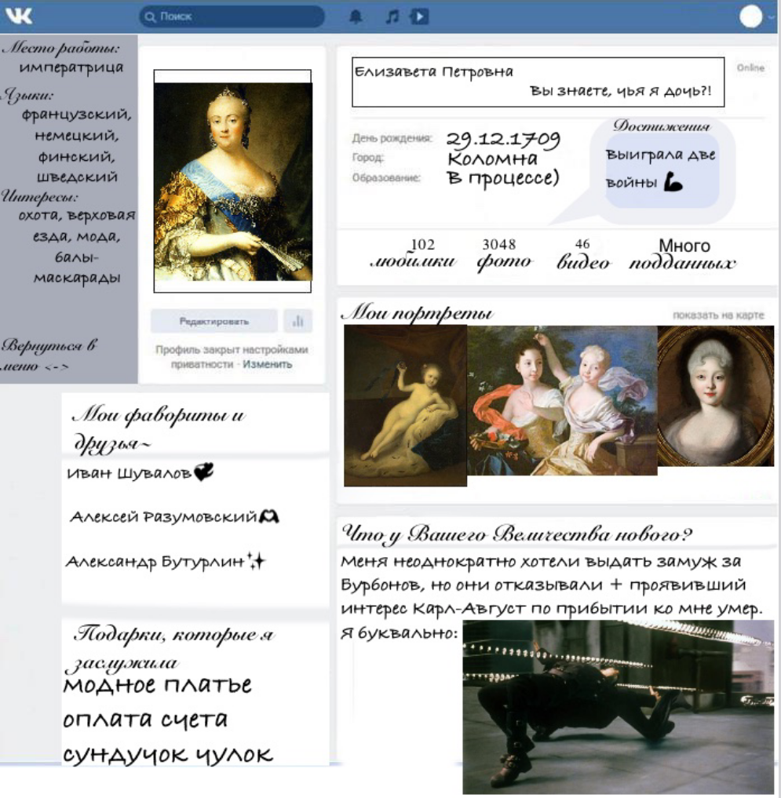

##  #Студент_которым_можно_гордиться

1. В понедельник, я переосилила себя и смогла встать и поехать на три пары английского. Хоть там и не сложно, но все равно так нудно, скучно и тяжело морально сидеть там. Невозможно даже пойти покушать -- нет времени, а преподаватель проверяет присутсвие, чуть что -- сразу звонит и пишет. Неприятно( 
2. Во вторник приятно поиграал в шахматы с подругой) я поставила ей шах и мат)))
3. В среду я плохо себя чувствовала и потому ушла после истории. Да, после первой пары:) По истории, кстати, было классное задание: сделать соц.сеть исторической личности, я выбрала Елизавету Петровну.
4. В четверг ничего необыного не было, прила на пары, а потом поехала домой. Самый нелюбимый день(

##  Соцсеть Лизоньки 

Вот, собственно, решила прикрепить страницу великой императрицы. Все получилось конечно не в лучшем качестве, потому что ночью надо спать, а не историей заниматься(

