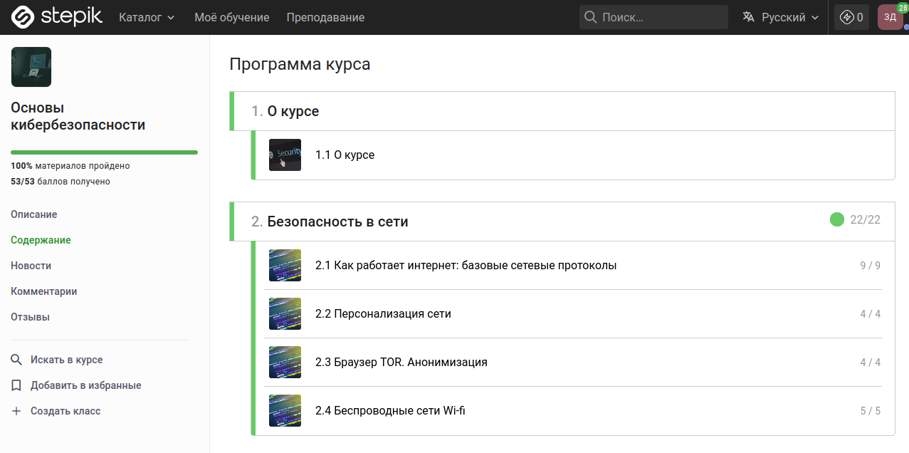

##  #Студент_которым_можно_гордиться

Я полностью прошла внешний курс на stepik 'Основы кибербезопасности'. Там было 53 задания в тестовом формате, также были видео-лекции, файлы для изучения.

Было очень интересно, узнала много нового, а сами тестовые вопросы были не такими сложными.

Так как по прошествии этого курса не выдают сертификат, я прикрепляю скрин того, что я прошла весь материал.

